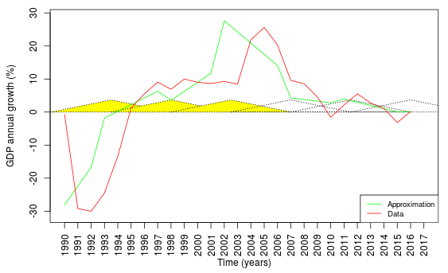

```{r setup, include=FALSE}
knitr::opts_chunk$set(echo = TRUE)
```

```{r load-packages, include=FALSE}
library(shiny)
```

## Into
## Algorithm Description
\pagebreak
## Source Code with Explanation

The application is built using Shiny package. The Shiny package for R allows us to build a simple HTML based app without putting much thought into actual web development, hence the code is split in 2 main parts regarding the app itself.  
  
```1.``` ***ui.R***  
Code for UI is the much simpler part, here we simply define what will be visible in the application using functions (controlos) from the shiny package, for exmaple
```{r, results='hide'}
names<-colnames(read.csv2("data_all_4.csv"))
selectInput("countryInput","Select country", choices = names[names!="year"])
```
Creates input control responsible for picking country for which we want to display the data. We also define output controls, such as:
```{r, results='hide'}
plotOutput("Plot")
textOutput("Years")
```
so that we can show our calculated results. The actual calculations take place in the 2nd part of the app.  
  
```2.``` ***server.R***  
This is the part of the code where actual calculations take place and plots are created, we can actually split this .R into part that calculates necessary data and then part that uses this data in order to plot obtained results. The *shinyServer()* function is responsible for actual server, in this function we render the plot using other functions written by us.  
Initially we have to create our partitions, we've decided to make them uniform so as to ease up our work and we create them using *uniformPartitioning* function, whose main part is:
```{.R}
s1 <- seq(0, len-h, by = h/2)
s2 <- seq(h/2, len-h/2, by = h/2)
s3 <- seq(h, len, by = h/2)
A <- Map(c, s1, s2, s3)
```
Where len is the length of vector of *x* values and *h* is fuzzy partition horizon picked by user.  
The three functions responsible for calculating function approximation, $\beta^0$ and $\beta^1$ are respecitvely named *get_F*,  *get_beta0* and *get_beta1*. Each of them works with accordance to aforementioned algorithms (report section 2).  
Hence in order to get $\beta^0$, we calculate weighted averages of the functional values (provided as the data) where weights are the membership degrees. Before diving into *get_beta0* itself, let's take a look at how we calculate the weights. We use this formula;
$$
    \begin{dcases}
        \frac{x-c_{i-1}}{c_i-c_{i-1}} & x \in [c_{i-1}, c_i] \\
        \frac{c_{i+1}-x}{c_{i+1}-c_{i}} & x \in [c_i, c_{i+1}] \\
        0 & otherwise
    \end{dcases}
$$
Whic translated to R code looks like this:
```{r}
func <- function(Ai, x) {
  ci<-Ai[1]
  ciii<-Ai[length(Ai)]
  cii<-median(Ai)
  ifelse(x>=ci & x<cii, (x-ci)/(cii-ci), ifelse(x>=cii & x<=ciii, (ciii-x)/(ciii-cii), 0))
}
```
Now to calculate $\beta^0$ we use discrete version of weighted average:
$$
\overline{x} = \frac{\displaystyle\sum_{i=1}^{n} x_i \cdot w_i}{\displaystyle\sum_{i=1}^{n} w_i}
$$
Where *w*s are weights. $\beta^0$ is calculated by going through the partitions $A$ and for each of them calculating weighted average by first calculating the numerator part of $\beta^0_i$, then the denominator and then dividing, it is achieved in a double for loop.
```{.r}
for (i in 1:length(A)){
  Ai <- A[[i]] # ith partition
  avg <- 0
  sum1 <- 0
  x2<-seq(Ai[1], Ai[length(Ai)], 1)
  for (j in x2[1]:x2[length(x2)]){
    if(j>length(y)) { # ifs to ensure no exceptions
      break;
    }
    if (j==0){
      next;
    }
    avg <- avg + y[j]*func(Ai, j) # numerator
  }
  sum1 <- sum(func(Ai,x2)) # denominator
  avg <- avg / sum1 # final result for given partition
  B0[i] <- avg
}
```
$\beta^1$ works in similar way, however it's numerator as well as denominator are slightly different, we calculate it as:
$$
\beta^1_k=\frac{\displaystyle\sum_{i=1}^{n} y_i \cdot (i-c_k) \cdot A_{k_i}}{\displaystyle\sum_{i=1}^{n}(i-c_k)^2 \cdot A_{k_i}}
$$
and translated to R code it is again a double for loop:
```{.r}
for (i in 1:length(A)){
  Ai <- A[[i]] # ith partition
  avg <- 0
  sum1<-0
  x2<-seq(Ai[1], Ai[length(Ai)], 0.000001)
  for (j in x2[1]:x2[length(x2)]){
    if(j>length(y)) { # ifs to ensure no exceptions
      break;
    }
    if (j==0){
      next;
    }
    avg <- avg + y[j]*func(Ai, j)*(j-Ai[2]) # nominator
    sum1 <- sum1 + func(Ai,j)*(j-Ai[2])^2 # denominator
  }
  avg <- avg / sum1 # final result for given partition
  B1[i] <- avg
}
```
Having calculated both $\beta^0$ and $\beta^1$ we can get our approximation $F$. To do that we use formula discussed in **algorithms** section.
```{.r}
for (i in 1:length(A)){
  for (j in seq(A[[i]][1], A[[i]][3], 0.001)){
    if(j>length(y)) { # ensuring no exception
      break;
    }
    fi[j]<-B0[i]+B1[i]*(j-A[[i]][2])
  }
}
F<-fi
```
Once we have calculated all of those subparts, we use them to  
1. Obtain structural breaks.  
The process of doing that is rather simple, we use threshold based on standard deviation of input data (discussed in **algorithms** section), namely:
```{.r}
right_context <- abs(sd(y)/2/h)
satisfactoryB1 <- B1>right_context
```
executing this code returns a logical array of values, where falses indicate structural breaks at given positions. We then use all of this combined in plotting.
2. Plot our results.  
```{.r}
plotPartitions(A, satisfactoryB1, y, x, maxVal, minVal)
lines(F*100, col="green")
lines(y*100, col="red")
```
takes care of plotting, where $F$ is approximation, $y$ is actual data and *plotPartitions()* plots the partitions we obtained earlier, colouring ones with structural breaks.  
We first create an empty plot with preset limitations based on x amount of data points to plot, minimal and maximal values to be plotted as well as the the partitions. *polygon()* function creates polygons indicating partitions, which are then scaled based on maximal value so that they don't appear completely ridiculous in some extreme cases.
```{.r}
plot(NULL, xlim=c(1,length(x_years)), ylim=c(minVal*100-1, maxVal*100+1), 
  ylab="GDP annual growth (%)", xlab="Time (years)", xaxt="n")
scale<-maxVal/7.5*100 # maxVal & minVal are the maximum and minimum value to be plotted
for (i in 1:len){
  Ai <- A[[i]]
  x <- seq(Ai[1], Ai[length(Ai)], 0.1)
  if(!D[i]) { # condition used to colour partition if it contains a break
    polygon(c(Ai[1], Ai[2], Ai[3]), c(func(Ai, x)[1], func(Ai, x)[func(Ai, x)==1]*scale, 
      func(Ai, x)[length(func(Ai, x))]), col="yellow", lty=3)
  } else {
    polygon(c(Ai[1], Ai[2], Ai[3]), c(func(Ai, x)[1], func(Ai, x)[func(Ai, x)==1]*scale, 
      func(Ai, x)[length(func(Ai, x))]), lty=3)
  }
}
# setting xticks as years instead of raw x values
axis(1, at=seq(1,length(x_years)), labels=x_years, las=2) 
```
\pagebreak
## Results
The results and their quality very heavily depend on chosen data as well as the fuzzy partition horizon ($h$). We can again look at the results in 2 ways, we can focus on the approximation $F$ and at the structural breaks themselves, tho they are sort of inseparable as one depends on the other.  
We can take a look at few examples to better illustrate this, if we take Czech Republic into consideration, we can see that the data has a few fairly big jumps, which we suspect could be structural breaks. When using large fuzzy partition horizon, say 10, we get this graph:

Where we can immiedietly tell that even though the approximation doesn't look too exact, the detected structural breaks are promising, we got 2004, 2009, which is something, however it looks as though some of the breaks were omitted and the one at the end looks very out of place, hence we try a different $h$, say 4.

Structural breaks detected here were 1995, 2001, 2005, 2007, 2011, 2015. Not only we got more of them, they also look accurate and the approximation function looks much closer to the plotted data itself.  
Another example could be that of Azerbaijan, when using $h=9$, we get 2007, 2011, 2016, breaks only focused in the end of the data

But when using something smaller, like $h=5$, we get more of them (1991, 1999, 2001, 2006, 2009, 2014) and they appear to be more accurate again, same goes for the approximation function.

Looking at those examples we can say that the results tend to be hit or miss, depending on chose fuzzy partition horizon, one of the choise would be such that
$h | length(x)$, but frankly, the best way to find accurate $h$ is to use trail and error method.

\pagebreak  

## Conclusions

## Example

This is an R Markdown document. Markdown is a simple formatting syntax for authoring HTML, PDF, and MS Word documents. For more details on using R Markdown see <http://rmarkdown.rstudio.com>.

When you click the **Knit** button a document will be generated that includes both content as well as the output of any embedded R code chunks within the document. You can embed an R code chunk like this:

```{r cars}
summary(cars)
```

## Including Plots

You can also embed plots, for example:

```{r pressure, echo=FALSE}
plot(pressure)
```

Note that the `echo = FALSE` parameter was added to the code chunk to prevent printing of the R code that generated the plot.

```{r}
xd<-sum(1:2)
```